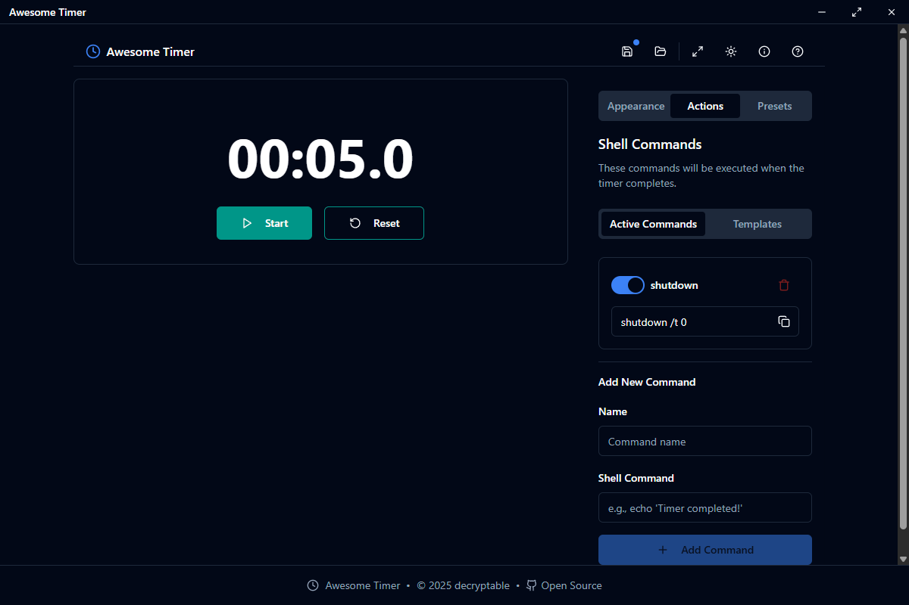
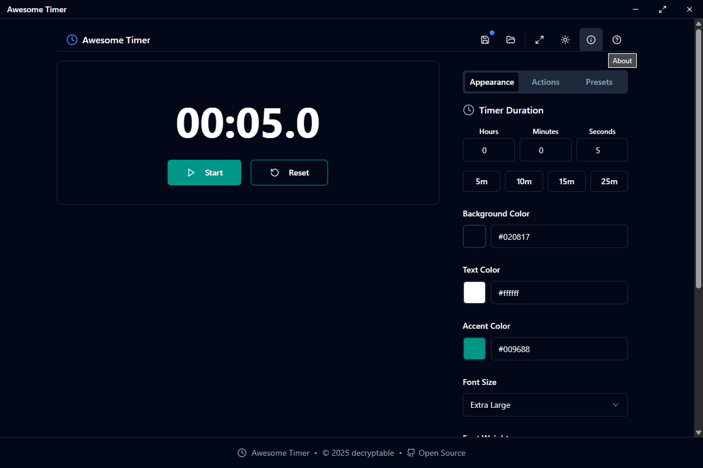
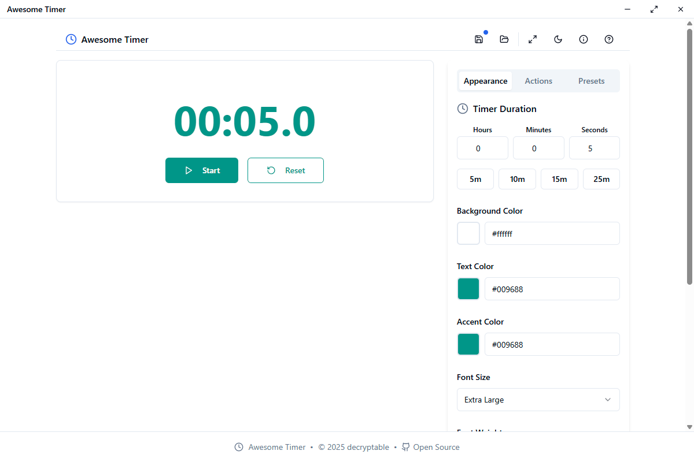
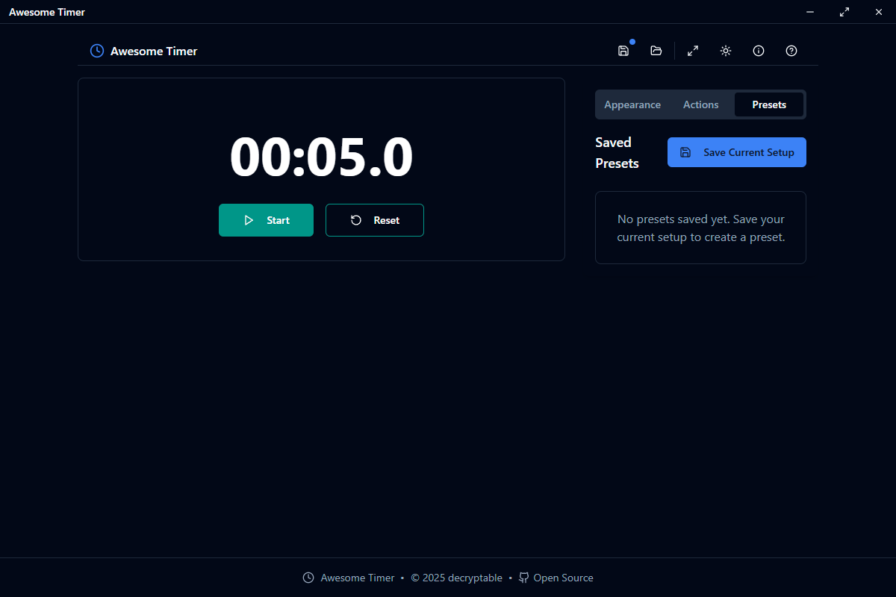
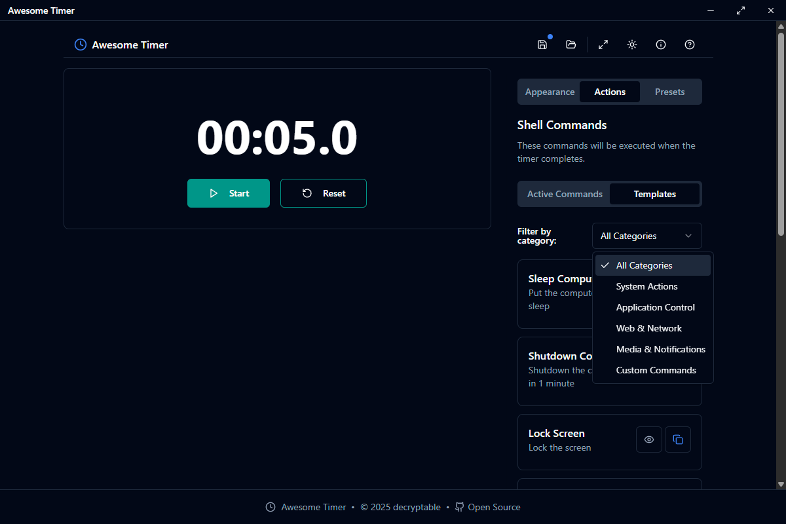

# Awesome Timer

A customizable timer application with shell command execution capabilities.

## Features

- Customizable timer with adjustable appearance
- Shell command execution when timer completes
- Preset management for saving and loading timer configurations
- Cross-platform support (Windows, macOS, Linux)

## Screenshots

|  |  |
|------------|-------|
| Custom Action |  |
| Dark Mode |  |
| Light Mode |  |
| Save Presets |  |
| Template Actions |  |
